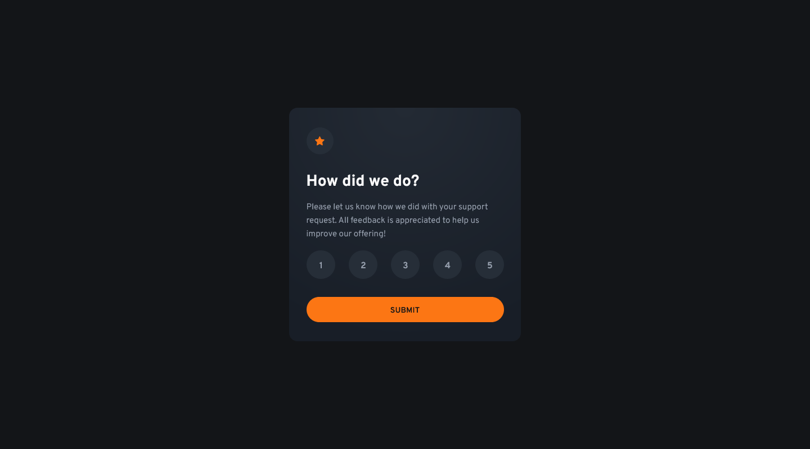

# Frontend Mentor - Interactive rating component solution

This is a solution to the [Interactive rating component challenge on Frontend Mentor](https://www.frontendmentor.io/challenges/interactive-rating-component-koxpeBUmI). Frontend Mentor challenges help you improve your coding skills by building realistic projects.

## Table of contents

-   [Overview](#overview)
    -   [The challenge](#the-challenge)
    -   [Screenshot](#screenshot)
    -   [Links](#links)
-   [My process](#my-process)
    -   [Built with](#built-with)
    -   [What I learned](#what-i-learned)
    -   [Continued development](#continued-development)
-   [Author](#author)

## Overview

### The challenge

Users should be able to:

-   View the optimal layout for the app depending on their device's screen size
-   See hover states for all interactive elements on the page
-   Select and submit a number rating
-   See the "Thank you" card state after submitting a rating

### Screenshot



### Links

-   Solution URL: [View solution on Frontend Mentor](https://www.frontendmentor.io/solutions/keyboard-accessible-interactive-rating-component-u_lcBrJmZ2)
-   Live Site URL: [View live site](https://alexander3717.github.io/RatingComponent/)

## My process

### Built with

-   SASS features
-   Vanilla JavaScript
-   Mobile-first workflow

### What I learned

If you need a circle element to keep its shape when it shrinks (normally it deforms to an ellipse), instead of doing this:

```css
.circle {
    width: 40px;
    height: 40px;
    border-radius: 50%;
}
```

you can omit the height (or width) and use the `aspect-ratio` property:

```css
.circle {
    width: 40px;
    aspect-ratio: 1 / 1;
    border-radius: 50%;
}
```

And here’s a slightly embarrassing one: I use VS Code, and there is this extension called Prettier, which automatically formats your code. Well — turns out it doesn't unless you enable "format on save" in VS Code settings and set Prettier as the default formatter. I spent so much time indenting and aligning stuff thinking Prettier is running, just doing something different than I thought. Nope, it was turned off. 🤦‍♂️

### Continued development

I need to focus more on proper code organization in future projects. This was a small challenge but still there were a lot of annoying differences between the mobile and tablet/desktop layout. And I easily got lost in them because I didn't take the time to set up some useful variables and mixins in the beginning. When "cleaning" the code at the end (because it was basically unmaintainable), I also realized that sometimes _not_ nesting CSS selectors might be better, even if you are using SASS.

## Author

-   Frontend Mentor - [@Alexander3717](https://www.frontendmentor.io/profile/Alexander3717)
